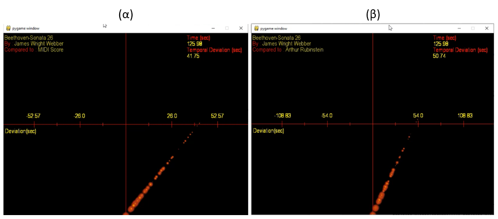

# FlameCens

FlameCens is a Python application for comparing two music performances and providing a visualisation of their expressive deviations in tempo and dynamics.

## Overview
FlameCens is an application for visualisation of expressive music performance. It compares an audio file to its corresponding musical score (imported in MIDI format) or to another performance of the same song by another artist (also an audio file). The application displays a dynamically modified "flame" texture that changes size according to the dynamics and angle according to the temporal deviation of music, compared to the target file. The vertical axis shows the position of zero temporal deviation while the horizontal axis shows the temporal deviation in seconds. The application also creates a .csv file that records the temporal deviation and the diffrence in dynamics (measured in db).

FlameCens-pitch is a variation of the application in which the flame changes color according to the pitch of the current note. The vaiation works only for monophonic music (polyphonic extention may be developed as future work)

In the screenshot below you can see a sample of the visualisation. Sonata No.26 of Beethoven played by pianist James Wright Webber is compared to a) musical score imported in MIDI format and b) to the same song as performed by Arthur Rubinstein

## Usage

*python FlameCens.py file1 file2 artist1 artist2 title tuning*
  
<pre>
file1     :The fle to be compared with (required - MIDI or .wav format) 
file2     :The audio file to be visualized (required - .wav format )  
artist1   :The artist in file1 (optional - text)  
artist2   :The artist in file2 (optional - text)  
title     :Title of the song (optional - text)  
tuning    :Key transposition in semitones (optional - integer)  
</pre>
  
Artist1, artist2 and title are optional information to be displayed in the visualisation. "Uknown" will be displayed in case they are not defined
Tuning is a parameter required in case the one of the compared tracks is shifted to another key

If the application is about to compare a track to its musical score imported in MIDI format, the MIDI file is converted to WAV in real time (playing / recording procedure). The real time procedure was chosen in order to make the application cross-platform and independent of third party synthesizer software

fire_yellow.png file is required for the polyphinic version (FlameCens.py) of the application.

## Required Python Modules
1)  librosa
2)  pyGame
3)  SciPy
4)  Wave
5)  PyAudio
6)  Numba

## Acknowledgements
FlameCens  was developed as a postgraduate project thesis in part requirement of the MSc in Sound and Music Technologies offered by the Department of Sound and 
Music Technologies of the Hellenic Mediterranean University (HMU).

<ins>Links:</ins>

Dept. of Music Technology and Acoustics: (https://mta.hmu.gr/en)

## Sample Videos

[Beethoven - Sonata No.26 by Arhtur Rubinstein - Compared to Score](https://www.youtube.com/watch?v=Rub3LwPp2Zw)

[Beethoven - Sonata No.26 by James Wright Webber - Compared to Arthur Rubinstein](https://www.youtube.com/watch?v=nGV7Dfx6GsQ)

[Paganini - Caprice No.4 in Cm (Maestoso) by James Ehnes - Compared to Michael Rabin](https://www.youtube.com/watch?v=7EBfmDLQJ38)

